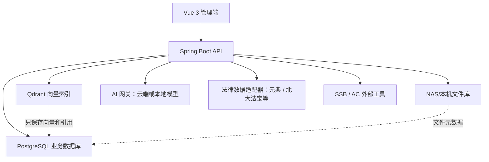

# ZGAI 至高律所管理系统 PRD

版本：3.0

基线日期：2026-07-22
状态：核心业务闭环试用与数据底座强化阶段

## 1. 产品目标

ZGAI 服务于至高律所内部律师、行政管理、主任/部门主管和财务人员，围绕案件从客户接洽、利冲、立案审批、办理、文档归档到开票的全过程形成统一数据底座。

本阶段必须真实可用的七项能力：

1. 案件管理。
2. 客户管理。
3. 立案审批。
4. 案件文件与 NAS。
5. 发票申请。
6. AI 知识库。
7. 旧系统基础资料检索底座；旧系统全量导入待用户提供数据后再实施。

试验性能力：AI 文书生成。银行批量建案由现有 SSB 项目承担，本阶段仅保留直接入口，不在 ZGAI 内重复开发。

## 2. 产品原则

- 核心闭环优先于模块数量。
- 后端权限优先于前端显示控制。
- 一案一档，文件本体与业务元数据分离。
- 所有审批、导出、删除、归档、配置和文件操作可审计。
- AI 先处理公开知识、公共模板和脱敏样本，不接触未授权案件私密材料。
- 当前可在局域网试用，但生产上线必须使用 PostgreSQL、HTTPS、备份恢复和安全评估。

## 3. 用户、部门与权限

### 3.1 所属部门

- 金融事务部。
- 民商法务部。
- 重整与清算部。
- 重大项目研究中心。
- 政府事务部。
- 法税合规部。
- 刑事法律事务部。
- 独立律师团队。
- 后勤保障部。

### 3.2 身份类别

- 主任。
- 部门主管。
- 行政管理。
- 律师。
- 实习律师。
- 助理。
- 财务/出纳通过岗位与角色权限组合配置。

“合伙人”在系统身份类别中统一调整为“部门主管”。

### 3.3 权限基线

| 能力 | 律师/实习/助理 | 行政管理 | 部门主管 | 主任 | 财务 |
|---|---|---|---|---|---|
| 案件查看 | 本部门 | 审批所需整体信息 | 本部门 | 全所 | 按授权 |
| 客户查看 | 本部门案源人或承办人相关客户 | 按授权 | 本部门 | 全所 | 五名特批人员或配置权限 |
| 利冲检索 | 全客户主体库检索 | 全客户主体库检索 | 全客户主体库检索 | 全客户主体库检索 | 按授权 |
| 发起立案 | 是 | 按授权 | 是 | 是 | 否 |
| 行政初审 | 否 | 是 | 否 | 可监管/代办 | 否 |
| 主任终审 | 否 | 否 | 否 | 是 | 否 |
| 案件文件 | 有权案件 | 审批及归档所需 | 本部门 | 全所 | 按授权 |
| 发票申请 | 是 | 是 | 是 | 是 | 审批与反馈 |
| 系统设置 | 否 | 受限 | 否 | 是 | 否 |

指定客户全库查看人员：田颖思、黄智明、邝凤兰、何俊慧、吴兴印。该规则应最终由角色或权限配置表达，不继续增加姓名硬编码。

## 4. 核心业务流程

### 4.1 客户与利冲

1. 员工创建客户主体，填写客户名称、类型、证件号/统一社会信用代码、所属部门、案源人、承办人和联系方式。
2. 客户列表按当前账号部门与案源人/承办人关系过滤。
3. 利冲检查页面保持简洁，输入拟签约客户名称即可发起检查。
4. 后端在全客户主体库、案件当事人和相对方中检查同名、相似名和身份标识。
5. 保存检查对象、操作人、时间、命中对象、命中案件、相似名称、结论与备注。
6. 检索命中不自动开放客户详情，正式结论由行政人员确认。

### 4.2 立案审批

业务约束：

- 承办人包括部门主管、律师、实习律师和助理。
- 案由自由填写；案件类型提供索引提示，不把案由限制为固定选择题。
- 仲裁案件允许填写仲裁机构/受理单位，不强制套用法院字段。
- 承办人从真实员工库选择，不出现虚构人员。
- 收费方式仅为固定收费、风险收费、基础+风险、其他。
- 审批详情使用右侧抽屉，案件列表“查看审批”和消息中心打开同一内容模型。
- 审批人可查看申请资料、利冲结果、案件信息和流程记录，并使用明确的同意、驳回、转审操作。
- 驳回必须填写理由，并通知发起人；归档结案前，授权人员可修改案件信息。
- `admin`/开发管理员按全权限处理，但不能绕过审计。

### 4.3 案件文件

- 行政初审和主任终审通过后创建案件档案。
- 一个案件对应一个档案根目录，目录由数据库模板驱动。
- 推荐目录：`01_立案材料`、`02_证据材料`、`03_法律文书`、`04_合同收费`、`05_往来函件`、`99_归档材料`。
- 文件本体存储在本机或 NAS；数据库保存案件、目录、原文件名、相对路径、大小、MIME、上传人、版本、哈希、索引状态等元数据。
- 同名文件不覆盖，生成新版本。
- API 不返回 NAS 绝对路径。
- 普通案件文件默认 `knowledge_eligible=false`，不得自动进入共享 RAG。

### 4.4 发票申请

1. 员工从财务管理进入发票申请。
2. 出纳反馈前，发起人可修改申请；待审查记录可删除。
3. 财务/出纳可查看完整申请，拖拽上传电子发票并反馈给申请人。
4. 发起人仅看到“反馈文件”并下载，不显示上传控件。
5. 反馈文件后，财务点击“完成开票”锁定记录。
6. 已完成开票记录不可修改或删除。
7. 黄智明（出纳）接收待办；后续应由角色配置替代姓名绑定。

### 4.5 知识库与 RAG

首期允许：

- 法律法规、司法解释和公开规范性文件。
- 律所内部制度、审批规则和归档规范。
- 公共合同、函件、申请书和报告模板。
- 已确认内部使用授权的外部参考资料。
- 其他全所通用、无客户隐私的知识。

首期禁止：

- 未脱敏真实案件、证据、合同和客户身份信息。
- 未授权旧系统案卷或外部平台内容。
- 已废止法规进入 RAG。
- 未确认授权的外部参考资料进入 RAG。

知识条目需记录来源类型、来源依据、发布机关、文号、生效日期、有效状态、授权确认、公开范围、AI 准入和索引状态。Qdrant 只保存向量和引用元数据，正文与原件以 PostgreSQL/文件库为准。未配置 Embedding 或 LLM 时必须明确显示关键词检索或仅检索模式。

### 4.6 外部法律数据库

外部法律数据采用“本地知识库 + 远程专业库”的联邦检索，不复制或抓取商业数据库整库。当前推荐顺序：

1. 元典开放平台作为第一接口试点：已有法规、案例、企业信息、引证核验 API/MCP，适合验证法规语义检索、类案检索和 AI 引用核验。
2. 北大法宝作为专业检索增强候选：已有 MCP/CLI 接入方式，重点比较案例覆盖、检索质量、稳定性和企业授权成本。
3. 国家法律法规数据库、人民法院案例库作为权威来源链接和人工复核依据；没有正式机器接口或书面授权时，不做自动抓取和镜像。
4. Alpha、法信、威科先行等先保留外部跳转；取得明确的企业 API、系统嵌入、缓存及 RAG 授权后，才开发适配器。

统一通过 `LegalSourceProvider` 接口提供法规检索、法规详情、案例检索、案例详情和引证核验。ZGAI 只保存查询审计、来源、文号/案号、有效状态、访问时间和授权允许的短期缓存；是否保存正文、摘要、向量或衍生结果以合同为准。所有结果必须显示数据提供方、原始链接、检索时间和有效状态。

外部查询默认不得发送客户姓名、证件号码、案号、证据或案件原文；需使用脱敏后的法律问题和检索要素。各适配器必须具备密钥隔离、超时、限流、额度统计、熔断和本地检索降级。购买网页会员不等于取得接口、再分发或 RAG 授权，禁止绕过接口抓取。

试点使用同一组至少 20 个法规、案例和引证核验问题对元典与北大法宝进行盲测，记录正确率、可追溯性、时效性、响应时间、单次成本和授权限制，再决定主数据源与备用源；首期不同时采购多个重叠数据库。

### 4.7 旧案资料检索

- 用户先选择当前账号有权查看的 ZGAI 案件。
- 后端从案件编号、法院案号、案件名称、客户和当事人提取强识别要素。
- 检索旧资料只返回文件名、相对信息、大小和修改时间，不返回物理根路径。
- 下载使用命中记录 ID，并在下载时再次校验来源案件权限和真实路径边界。
- 真实旧资料根目录、命名规则与映射样本由用户后续提供。
- 当前不做旧系统全量数据导入。

## 5. 功能状态矩阵

### 5.1 已完成并有代码/测试依据

| 模块 | 已完成能力 |
|---|---|
| 登录与账号 | JWT 登录、员工账号、部门/身份类别、管理员保护、权限集合返回 |
| 工作台 | 律师日历导向、行政待办导向、主任全局、财务开票导向 |
| 案件 | 新建、列表、筛选（含案由/部门）、详情、时间线、归档/回收站基础、部门数据范围 |
| 客户 | 新建、编辑、详情、案源人/承办人、部门数据范围、指定全库查看权限 |
| 利冲 | 简洁姓名检索、全客户库检查、检查记录、立案审查入口 |
| 审批 | 独立审批中心、待办、详情抽屉、消息入口、同意/驳回理由/转审、行政与主任阶段 |
| 案件文件 | NAS/本地文件、目录元数据、上传、下载、版本、回收站、分片上传、路径隐私 |
| 发票 | 申请、修改、待审删除、财务查看、反馈文件、完成锁定、申请人下载 |
| 知识库 | 分类、文章、PDF/DOCX/TXT/MD 导入、原件下载、索引状态、关键词降级、法规时效与授权准入 |
| 旧资料检索 | 基于有权案件要素检索、留痕、结果记录、受控下载 |
| 系统运维 | 健康中心、真实备份基础、审计日志、PostgreSQL 初始化脚本 |
| 外部工具 | 省时宝直接跳转、AC 精算入口基础 |

当前自动验证基线：后端 101 项测试通过，前端生产构建通过。

### 5.2 已有基础但仍需优化

| 优先级 | 模块 | 主要缺口 | 验收方向 |
|---|---|---|---|
| P0 | 真实角色回归 | 缺普通律师、行政、主任、财务四类真实账号自动回归凭据 | 四类账号完成核心只读与审批流程，不越权 |
| P0 | PostgreSQL | 脚本和 profile 已有，当前主试用仍可能运行 H2 | 完成数据迁移、回滚、备份恢复和多人并发演练 |
| P0 | 审批路由 | 特定人员与通用审批仍存在配置/姓名混用风险 | 审批人由岗位、部门和规则配置，不硬编码姓名 |
| P0 | UI/UX | 页面风格和信息密度未形成完整设计系统 | 四类工作台和核心页面完成一致、可用、响应式设计 |
| P0 | E2E | 主要是服务层测试和脚本冒烟，浏览器自动化不足 | 覆盖建客户、立案、两级审批、建档、开票闭环 |
| P1 | 案件文件 | 需真实 NAS 长时稳定性、并发上传和恢复验证 | 断网恢复、版本一致性、权限和大文件测试通过 |
| P1 | 利冲 | 相似名、统一代码、关联企业和正式报告仍需增强 | 结构化审查和可归档报告，人工结论可追踪 |
| P1 | 知识内容 | 只有少量真实法规，内部制度和模板尚未系统导入 | 首批资料完成授权、时效和检索评价 |
| P1 | RAG | Qdrant、Embedding、LLM 未形成稳定运行配置 | 明确模型状态、引用正确率和隐私越界为零 |
| P1 | 外部法律数据 | 尚未签订 API/嵌入/RAG 授权，也未完成供应商对比 | 完成元典试点、北大法宝对照评测和合同边界审查 |
| P1 | 旧案检索 | 缺真实旧资料根目录、目录样本和离线索引 | 用户提供样本后完成规则与性能验证 |
| P1 | 备份灾备 | 有备份能力，缺生产恢复演练和保留策略 | PostgreSQL 备份、校验、恢复和告警闭环 |
| P2 | 性能 | 前端主分块偏大，后端缺正式压测 | 首屏、列表、检索和上传达到约定 SLA |

### 5.3 暂缓范围

- 旧系统全量案件/客户导入，等待用户整理数据和字段映射。
- 银行批量建案，先由 SSB 项目承担。
- SSB 深度融合，当前仅直接跳转。
- 全量案件材料 RAG。
- AI 自动作出利冲结论、正式法律意见或审批决定。
- 多台 Mac 串联运行 35B 模型；先完成单机基准后再决定硬件。

## 6. 数据架构

### 6.1 目标架构

H2 仅用于开发和自动测试，不作为多人试用与生产数据底座。

### 6.2 核心数据域

- `case_info` / 案件主表：案件状态、编号、部门和负责人。
- `case_party`：客户、委托人、相对方和其他主体，一案多主体。
- `client`：客户主体、身份标识、案源人、承办人和部门。
- `approval` / `approval_flow`：审批单、步骤、处理人、意见和时间。
- `document_folder` / `case_document`：目录、文件元数据、版本和索引状态。
- `conflict_check_record`：利冲对象、命中与人工结论。
- `invoice`：发票申请、反馈文件与完成锁定。
- `knowledge_article`：知识正文、来源、时效、授权和索引状态。
- `audit_log`：关键操作留痕。

## 7. 非功能要求

### 7.1 安全

- 所有业务接口默认要求认证。
- 每个高风险写接口使用服务端权限检查和审计。
- 密码使用强哈希；首次密码应强制修改。
- 密钥、数据库密码和 NAS 凭据仅通过环境变量或密钥服务注入。
- 公网部署必须使用 HTTPS、限制管理入口并配置访问日志。
- 导出、下载和 AI 调用不得扩大原数据可见范围。

### 7.2 可用性

- 桌面端 1440px 和 1024px 不应出现重叠、操作列丢失或长文本溢出。
- 390px 移动端至少支持待办、审批详情和案件基本信息查看。
- 审批和文件上传要有加载、成功、失败、无权限、已锁定和空状态。
- 删除、驳回、归档和完成开票需二次确认。

### 7.3 数据可靠性

- 数据库事务失败时不得留下已登记但不存在的文件。
- 文件下载必须校验业务权限、相对路径和真实路径边界。
- PostgreSQL 备份采用可校验格式，生产恢复必须离线演练。
- 案件、客户、审批、文件和发票的关键状态变化必须有时间线或审计记录。

## 8. 分阶段验收

### 8.1 P0：可控试用

- 四类账号权限回归通过。
- 客户、立案、行政初审、主任终审、建档、文件上传和发票流程完成浏览器 E2E。
- PostgreSQL 测试环境迁移和备份恢复通过。
- NAS 断开时系统明确报错，不产生错误元数据。
- 管理员不能绕过审批资料显示与审计规则。

### 8.2 P1：知识与数据增强

- 首批法规、制度、模板完成来源和时效核验。
- 经授权参考资料有授权确认记录；未授权内容不进入 RAG。
- RAG 评价集来源命中、引用正确性和隐私测试通过。
- 外部法律库使用统一适配器完成至少 20 题对照评测，且不向供应商发送案件私密数据。
- 旧案检索接入真实只读目录，并通过跨部门权限和性能测试。

### 8.3 P2：生产准备

- UI 设计系统和核心页面重构完成。
- HTTPS、监控、告警、备份保留和恢复演练完成。
- 关键接口压测、安全评估和操作手册完成。
- 真实试用反馈关闭 P0/P1 缺陷后才允许正式上线。

## 9. 并行研发分工

| 工作流 | 建议执行方 | 负责范围 | 禁止越界 |
|---|---|---|---|
| A 案件与审批 | Codex/后端 Agent | 案件、当事人、两级审批、时间线 | 不修改知识和财务状态机 |
| B 客户与利冲 | Codex/后端 Agent | 客户权限、主体关系、利冲报告 | 不开放跨部门客户详情 |
| C 文档与数据底座 | Codex + 外部后端 | PostgreSQL、NAS、版本、备份恢复 | 不把文件本体放数据库 |
| D 知识与 AI | Codex/AI Agent | 知识分类、索引、评价、AI 网关、法律数据适配器 | 不接入真实案件私密材料，不抓取商业数据库 |
| E UI/UX | 外部设计/前端团队 | 设计系统、工作台和核心页面 | 不改变后端业务规则 |
| F QA/安全/部署 | 外部专项团队 | E2E、压测、安全、生产部署 | 不使用真实数据做非受控测试 |

具体文件边界、分支和交接要求见 [handoff.md](handoff.md)。

## 10. 待用户确认的决策

以下事项没有确认前不得由 Agent 自行扩展：

1. PostgreSQL 部署在当前 Mac mini、NAS 容器还是独立服务器。
2. 正式旧资料根目录、脱敏目录样本和旧案命名规则。
3. 元典、北大法宝或其他外部法律库的预算，以及 API、缓存、嵌入和 RAG 授权范围。
4. 本地 AI 是否采用 `Qwen3.6-35B-A3B`，以及云端/本地分流规则。
5. 单机 Mac Studio 或其他硬件采购，须在模型基准测试后决定。
6. 普通律师、行政、主任和财务真实测试账号的安全提供方式。
7. 生产域名、HTTPS、公网访问和日志保留策略。

## 11. 完成定义

某功能只有同时满足以下条件才可标记“完成”：

- 业务规则与本 PRD 一致。
- 后端权限和数据范围经过测试。
- 正常、失败、无权限和重复操作均有明确行为。
- 关键写操作有审计或业务时间线。
- 自动测试通过，核心流程完成真实角色或浏览器验证。
- 文档和数据库脚本同步更新。
- 不依赖硬编码测试人员、演示数据或开发机绝对路径。
