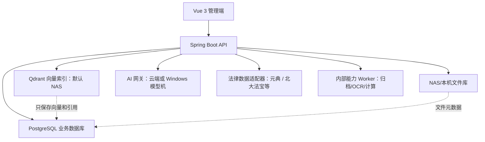

# ZGAI 至高律所管理系统 PRD

版本：3.47

基线日期：2026-07-24
状态：案件全生命周期与 AI 协同试用阶段

## 1. 产品目标

ZGAI 服务于至高律所内部律师、行政管理、主任/部门主管和财务人员，围绕案件从客户接洽、利冲、立案审批、办理、文档归档到开票的全过程形成统一数据底座。

本阶段必须真实可用的七项能力：

1. 案件管理。
2. 客户管理。
3. 立案审批。
4. 案件文件与 NAS。
5. 发票申请。
6. AI 知识库。
7. 旧系统基础资料检索底座；旧系统全量导入待用户提供数据后再实施。

试验性能力：AI 文书生成。SSB 银行批量建案、AC 精算和 GD 智能归档均以其现有项目作为业务规则与算法参考，最终能力必须在 ZGAI 内原生复现；当前不把外部项目跳转或独立 API 页面视为融合完成。

## 2. 产品原则

- 核心闭环优先于模块数量。
- 后端权限优先于前端显示控制。
- 一案一档，文件本体与业务元数据分离。
- 所有审批、导出、删除、归档、配置和文件操作可审计。
- GD、AC、SSB 采用“能力内化”原则：统一使用 ZGAI 账号、权限、案件、客户、文件、状态机、界面和审计，不保留面向用户的独立产品入口、独立业务数据库或重复档案。
- AI 先处理公开知识、公共模板和脱敏样本，不接触未授权案件私密材料。
- 当前可在局域网试用，但生产上线必须使用 PostgreSQL、HTTPS、备份恢复和安全评估。

## 3. 用户、部门与权限

### 3.1 所属部门

- 金融事务部。
- 民商法务部。
- 重整与清算部。
- 重大项目研究中心。
- 政府事务部。
- 法税合规部。
- 刑事法律事务部。
- 独立律师团队。
- 后勤保障部。

### 3.2 身份类别

- 主任。
- 部门主管。
- 行政管理。
- 律师。
- 实习律师。
- 助理。
- 财务/出纳通过岗位与角色权限组合配置。

“合伙人”在系统身份类别中统一调整为“部门主管”。

### 3.3 权限基线

| 能力 | 律师/实习/助理 | 行政管理 | 部门主管 | 主任 | 财务 |
|---|---|---|---|---|---|
| 案件查看 | 本部门 | 审批所需整体信息 | 本部门 | 全所 | 按业务范围只读 |
| 客户查看 | 本部门案源人或承办人相关客户 | `CLIENT_VIEW_ALL` 时全所 | 本部门 | 全所 | `CLIENT_VIEW_ALL` 时全所 |
| 利冲检索 | 全客户主体库检索 | 全客户主体库检索 | 全客户主体库检索 | 全客户主体库检索 | 按授权 |
| 发起立案 | 是 | 按授权 | 是 | 是 | 否 |
| 行政初审 | 否 | 是 | 否 | 可监管/代办 | 否 |
| 主任终审 | 否 | 否 | 否 | 是 | 否 |
| 案件文件 | 有权案件 | 审批及归档所需 | 本部门 | 全所 | 有权案件只读 |
| 发票申请 | 是 | 是 | 是 | 是 | 审批与反馈 |
| 系统设置 | 否 | 受限 | 否 | 是 | 否 |

现有客户全库查看人员通过 `CLIENT_AUDITOR` 能力角色维护；开票处理人通过 `INVOICE_PROCESSOR` 维护；立案行政管理人员通过 `CASE_FILING_ADMIN` 维护。环境变量只负责首次绑定现有账号，运行期授权统一读取角色权限，不再按姓名判断。

员工导入、管理员新建账号和重置密码产生的密码均视为初始密码。账号登录后只能读取本人身份并修改密码；完成至少 8 位的新密码设置前，后端以 `428` 阻断案件、客户、审批、财务、知识库及 AI 等全部业务接口。新密码不得与当前密码相同，修改成功后立即解除限制。`admin`、`amin` 开发管理账号不执行初始密码迁移，但密码修改仍留审计记录。

## 4. 核心业务流程

### 4.1 客户与利冲

1. 员工创建客户主体，填写客户名称、类型、证件号/统一社会信用代码、所属部门、案源人、承办人和联系方式。
2. 客户列表按当前账号部门与案源人/承办人关系过滤；同部门员工可查看本部门关联客户，但只有实际案源人、承办人、主任或管理员可修改。
3. 客户名称、案源人、承办人关键字、客户类型和所属部门使用服务端组合筛选，必须先完成权限与筛选再分页，不得只过滤当前页；列表总数始终是筛选后的可见总数。
4. 客户详情完整展示客户类型、客户关系、角色、所属部门、案源人、承办人、主体身份、联系方式、状态和备注；关联案件同时兼容结构化客户 ID 与历史当事人名称，但只返回当前账号本身有权查看的案件。
5. 客户详情可维护一层显式关联主体，支持母公司、子公司、关联企业、实际控制人、法定代表人、曾用名、担保关系和其他关联；关系可指向现有有权客户或手工登记的外部主体，并保留登记人和说明。
6. 利冲检查页面保持简洁，输入拟签约客户名称即可发起检查；新建立案提交时，系统对所有标记为“委托方”的主体自动生成案件专属初筛记录。
7. 后端在全客户主体库、案件当事人、相对方和已登记关联主体图谱中检查同名、相似名、身份标识和一层主体关系。
8. 保存检查对象、操作人、时间、命中对象、命中案件、相似名称、关联主体快照、结论与备注。
9. 检索命中不自动开放客户详情；具有 `CASE_FILING_REVIEW` 权限的行政人员作出“无冲突通过、存在冲突不通过、附条件通过”正式结论。附条件通过必须填写书面豁免或风险处置依据，并上传至少一份 PDF、Word 或图片格式的原件；原件提交后随正式结论锁定。
10. 系统生成结构化初筛结果、历史记录和唯一报告编号；正式结论保存复核人和时间，提交后不可覆盖，需要复核时重新发起检查并生成新报告编号。
11. 行政初审前必须完成案件全部委托方的正式利冲审查；存在“不通过”结论时系统禁止同意立案，要求驳回并说明理由。
12. 主任终审通过后，系统把初筛、行政正式结论、复核人/时间、豁免依据和主任意见合并为案件利冲报告；书面依据原件分别生成案件文档，连同报告存入 `01_立案材料` 并回填文档归档状态。
13. 历史存量审批没有结构化利冲记录时继续沿用审批意见，避免系统升级后锁死既有流程；新申请必须使用结构化记录。

### 4.2 立案审批

业务约束：

- 承办人包括部门主管、律师、实习律师和助理。
- 案由自由填写；案件类型提供索引提示，不把案由限制为固定选择题。
- 仲裁案件允许填写仲裁机构/受理单位，不强制套用法院字段。
- 承办人从真实员工库选择，不出现虚构人员。
- 案件列表筛选、详情团队编辑、案件动态提及以及日程/待办表单统一读取真实员工和当前账号有权案件，不保留演示人员选项。
- 案件列表支持案件名称/案号、类型、状态、案由、部门、主办律师、审理机构和立案日期组合筛选；立案日期必须使用 `YYYY-MM-DD` 且开始日期不得晚于结束日期。
- 批量直接结案和批量归档入口停用；结案必须逐案进入最终办理阶段后提交结构化结案申请，归档必须完成律师核对和行政复核。批量变更主办律师不允许已结案/已归档案件。
- 案件列表每一行由后端按案件关系、身份和权限返回 `canEdit/canDelete/canArchive`；前端行按钮和批量复选框必须使用该有效操作集合，只读案件不得进入批量操作。删除、恢复和归档接口同样执行案件对象管理范围校验，不能依靠手工调用绕过页面限制。
- 案件详情由后端返回当前账号的有效操作集合；编辑、阶段变更、删除和归档按钮不能只按全局权限展示。已结案或已归档案件锁定普通编辑；只有已结案民事案件可发起首期智能归档，只有最终 PDF、来源清单、页数和哈希全部校验成功后才可转为已归档。
- 收费方式仅为固定收费、风险收费、基础+风险、其他；案件详情及复制的案件摘要必须显示中文业务名称，不得直接展示 `FIXED`、`CONTINGENT` 等内部代码，编辑选项须与新建立案保持一致。
- 案件类型统一为民事诉讼、商事仲裁、刑事、行政、非诉专项和法律顾问六类；商事仲裁为独立类型，不再作为民事案件的审理阶段。
- 每类案件使用独立的主体角色和流程模板：民事区分原告/被告，仲裁区分申请人/被申请人，刑事区分犯罪嫌疑人/被告人/被害人，行政区分行政相对人/行政机关，非诉区分委托人/交易对方，顾问区分顾问单位及其联系人。
- 法律顾问案件必须从当前用户有权的非个人客户中选择“顾问单位”，并登记服务期限、联系人、服务范围、响应要求、包含/不包含事项和续签提醒；顾问单位同时建立为案件主体及关联客户。案件类型切离顾问后必须清除顾问专属隐藏字段和顾问单位主体，避免错误关联。
- 案件详情按类型展示内部办理要素与阶段清单；列表统一展示“案件主体”，不把非诉、刑事、仲裁或顾问案件套用“原告 vs 被告”。
- 新建案件和案件详情均展示该类型的标准流程与律师办理重点；详情页按真实阶段状态区分待开始、进行中和已完成。
- 阶段待办统一使用案件类型代码匹配，进入某一阶段时才为案件主办人创建该阶段任务，不在立案时一次性堆积全部未来待办。
- 待审批案件不得推进办理阶段；案件状态、当前阶段、立案日期、结案信息和归档信息只能通过审批、阶段、结案和智能归档专用流程修改，普通案件编辑接口必须拒绝这些字段，避免绕过审批与审计。
- 民事、仲裁、刑事、行政、非诉和顾问六类案件均须具备完整阶段模板和进入阶段时生成的待办模板；历史 `COMMERCIAL` 仲裁类型只做兼容映射，不作为新的业务类型继续扩散。
- 立案审批中、尚无完成阶段历史的旧通用流程可安全迁移为类型专属流程；已进入正式办理或已有完成记录的案件不自动改写。
- 审批详情使用右侧抽屉，案件列表“查看审批”和消息中心打开同一内容模型。
- 审批人可查看申请资料、利冲结果、案件信息和流程记录，并使用明确的同意、驳回、转审操作。
- 驳回必须填写理由，并通知发起人；归档结案前，授权人员可修改案件信息。
- `admin`/开发管理员按全权限处理，但不能绕过审计。
- 所有收费方式均执行行政初审和主任终审；免费代理只增加免费理由审查，不再是触发主任终审的唯一条件。
- 立案路由使用 `CASE_FILING_REVIEW` 和 `CASE_FILING_FINAL_APPROVE` 权限寻找处理人；审批中案件修订使用 `CASE_FILING_MANAGE`，不与具体姓名绑定。
- 自动路由在权限满足的前提下优先专职能力角色：`CASE_FILING_ADMIN` 负责行政初审、`MANAGER` 负责主任终审、`INVOICE_PROCESSOR` 接收开票待办，避免主任的全权限身份被误选为普通经办人。

#### 4.2.1 公章用印审批

- 律师可从审批中心上传 PDF、Word、Excel 或图片发起公章用印申请，单个文件不超过 50MB。
- 用印申请不允许手工指定审批人，系统使用 `SEAL_APPROVE` 权限自动流转至行政管理账号；主任和开发管理员保留全权限与审计责任。
- 行政审批抽屉必须直接展示文件名、来源、大小和状态，并允许在同一页面下载审阅；同意用印必须填写审批意见，驳回必须填写理由。
- 案件文件列表为支持用印的已上传文书提供“申请用印”快捷操作，直接引用原 `case_document`，不复制、不覆盖案件原文件，也不得跨案件引用。
- 审批通过或驳回后同步更新附件状态、审批流程、案件进展和申请人通知，保留申请人、审批人、时间、文件哈希及处理意见。
- 独立上传的用印文件存入 `APPROVAL_FILE_ROOT`；NAS/云端容器必须挂载持久化目录，API 不返回物理路径。

#### 4.2.2 正式结案复核

- 只有处于办理中、已经依次进入该类型最后办理阶段且当前账号具有案件编辑权限的案件可以申请结案。
- 律师必须填写结案方式、案件结果、结案小结、费用处理、客户交付情况，并从当前案件有效文档中选择至少一份结案依据；文件只建立引用，不复制、不覆盖原件。
- 系统按 `CASE_ARCHIVE_REVIEW` 自动路由至行政人员，同时生成审批消息和重要待办；待办在批准、驳回或撤回时同步关闭。
- 行政审批抽屉展示结构化结案资料、申请人确认状态和依据文件，并允许直接下载核对；批准与驳回均必须填写意见。
- 只有行政批准事务成功后，案件最后阶段才标记完成，案件状态、结案方式和结案日期才统一写入；结案日期使用实际批准日。失败或驳回不得形成半成品结案状态。
- 同一案件不能同时存在多个待复核结案申请；驳回或撤回后可重新申请。普通编辑、通用审批和旧批量接口均不得绕过此流程。
- 正式结案完成后才可进入智能归档；AI 只能检查材料或生成小结草稿，不得自动提交、批准或改变结案状态。

### 4.3 案件文件

- 行政初审和主任终审通过后创建案件档案。
- 一个案件对应一个档案根目录，目录由数据库模板驱动。
- 推荐目录：`01_立案材料`、`02_证据材料`、`03_法律文书`、`04_合同收费`、`05_往来函件`、`99_归档材料`。
- 文件本体存储在本机或 NAS；数据库保存案件、目录、原文件名、相对路径、大小、MIME、上传人、版本、哈希、索引状态等元数据。
- 同名文件不覆盖，生成新版本。
- API 不返回 NAS 绝对路径。
- 普通案件文件默认 `knowledge_eligible=false`，不得自动进入共享 RAG。
- 顾问案件文件页提供“上传法律意见书”快捷入口，仍使用案件标准目录、版本、权限、哈希和 NAS 元数据规则。

### 4.4 案件全链路 AI 协同

| 办理阶段 | 律师操作 | AI 协助与边界 |
|---|---|---|
| 客户接洽 | 建客户、录主体、利冲 | 提取主体、访谈提纲、建议全库利冲；主体修改须确认 |
| 委托立案 | 填案件、收费、承办人、提交审批 | 预填、缺项检查、立案摘要；不得代替审批 |
| 审批建档 | 补资料、处理驳回、建立档案 | 汇总信息、利冲报告初稿；不得同意、驳回或终审 |
| 起诉受理 | 准备材料、登记案号和送达 | 材料检查、文书草稿、文书识别；写入前核对 |
| 保全举证 | 跟踪裁定、登记期限和证据 | 提取金额、法院、期限，生成待办；关键期限须确认 |
| 庭前开庭 | 建日程、准备提纲、出庭 | 明确指令自动建日程、案件进展及 7 天/1 天/2 小时提醒 |
| 裁判二审 | 上传裁判文书、判断后续程序 | 提取结果、金额和期限；阶段变化必须再次确认 |
| 执行归档 | 登记执行进展、结案检查 | 提取执行措施、检查目录、生成摘要；不得自动结案归档 |

案件主阶段保持简洁，保全、鉴定、管辖异议等作为并行程序记录。刑事、行政和仲裁使用各自程序模板，首条完整浏览器 E2E 以民事案件为准。

AI 操作分级：

- 自动执行：律师明确指示且案件、时间、地点完整的个人日程、个人待办和案件进展。
- 补充追问：缺少日期、时间、地点或无法唯一匹配案件时，不写入任何业务数据。
- 中文时间支持明确年月日以及“今天、明天、后天、今晚、上午、下午、晚上、几点”等常见表达；未写年份时只推断最近的未来日期，明确为过去时间时必须追问，不生成过期事项。
- 确认后执行：文件归属、识别结果、期限、程序信息和文件夹位置。
- 再次确认：案件阶段和其他核心字段变更。
- 禁止自动执行：审批、驳回、结案、归档、删除、对外发送、客户/当事人关系变化和正式法律结论。

每条指令保存幂等键、脱敏指令摘要、原文 SHA-256、结构化动作、风险等级、操作者、案件、执行状态和时间，新记录不得持久化指令原文。案件详情入口锁定当前案件；全局入口仅能检索当前账号有权访问的案件。动作执行器采用白名单，当前仅允许日程、待办、进展和确认后的阶段变更。阶段变更在提案前校验类型化流程，只允许进入紧邻的下一阶段；跳级或未知阶段仅返回澄清，合法提案仍不立即写入，用户必须在目标阶段及影响提示后再次确认。关联案件的日程和待办必须同时满足案件编辑权限；仅能查看案件的账号不得创建、改绑或修改案件事项，前端同步禁用指令与智能归案并说明原因。执行成功后可直接进入“日程与待办”或案件动态回看结果。三档提醒只登记尚未到达的提醒时间，避免临近开庭时一次发送多条已经过期的提醒。

案件操作指令当前由确定性的 `RULE_ENGINE_V1` 解析，不向用户展示未实际参与解析的模型选择器；智能归案固定使用本地识别链路。通用 AI 问答和案件问答仅提供只读回答，即使模型返回旧版命令标记也不得据此修改业务数据；需要写入日程、待办、进展或阶段时必须进入案件 AI 工作台。兼容性文书识别接口同样固定使用本地模型且只返回待核对要素，不得自动建案、创建待办、登记日程、写入动态或归档文件；旧自动业务执行器不再保留。AI 文书生成在读取案件前执行对象级权限校验，统一通过生成网关调用本地或用户明确选择的云端模型，使用权限以 `CASE_VIEW` 为准，不通过固定角色名称排除实习律师或助理。

智能归案采用临时接收区：文件先计算 SHA-256，文字 PDF/DOCX/TXT/MD 直接提取，扫描 PDF 和图片使用局域网内 Tesseract 中文 OCR。系统提取案号、机构、当事人、文书类型、日期、金额、期限和结果，按当前账号案件权限返回最多三个候选；律师确认案件、目录和文书类型后，才写入 NAS、文档元数据和进展台账。识别到开庭时间、地点或期限时，页面只提供默认关闭的建议操作；律师勾选并校正完整日期、地点或待办标题后，才同步创建开庭日程、三档提醒或个人期限待办。文件元数据、进展和确认后的日程/待办在同一事务中提交，后续写入失败时清理本次复制的文件；临时原件只在事务提交成功后删除，回滚时继续保留供重试。未确认文件默认保留 72 小时，每小时分批清理；过期时清除临时原件、OCR 正文、结构化分析和候选案件，越出配置接收区的异常路径只标记告警、不得删除。重复哈希不覆盖，案件材料始终默认禁止共享 RAG。

### 4.5 本地智能一键归档

首期覆盖民事案件，归档状态为 `PRECHECK → OCR → CLASSIFYING → EXTRACTING → LAWYER_REVIEW → ADMIN_REVIEW → ASSEMBLING → COMPLETED`，失败进入 `FAILED`，行政驳回进入可由原发起律师修订并重新提交的 `REJECTED`。

1. 首次归档仅限已结案且当前用户具有案件管理权限的民事案件；已归档案件只有填写更正原因才可创建新版本任务，原案件文件始终只读。
2. ZGAI 原生归档页读取案件全部有效文档，律师可排除无关件、修改卷内目录，并拖拽补充 PDF、Word、Excel 或图片材料。
3. 内部 `archive-worker` 复用并重构 GD 的 OCR、分类、字段提取、排序与合卷逻辑，但不拥有账号、案件库或面向用户的独立界面。
4. 文字 PDF 直接提取，扫描件优先使用 PaddleOCR、Tesseract 备用；Qwen 只读取当前案件当前文档的必要文本，禁止自动回退云端。
5. 归档表格使用固定 PDF 坐标和内嵌中文字体生成，不调用桌面 Word；图片按比例放入 A4 页面，不裁切原件。
6. 律师核对材料目录和结构化字段后提交行政复核；关键合同、授权书、结案依据或日期缺失时，行政批准必须填写例外理由。
7. 预览与最终文件使用同一渲染引擎。最终成果包括电子卷宗 PDF、书签、可搜索文本层、来源页码区间、文件哈希及 JSON 来源清单。
8. PDF 与清单均按版本写入 `99_归档材料`，不可覆盖旧版本；只有页守恒 `gapPages=0`、`duplicatePages=0` 且 NAS 写入成功后，案件才锁定为 `ARCHIVED`。
9. 行政使用 `CASE_ARCHIVE_REVIEW`，律师使用 `CASE_ARCHIVE`；普通律师不得归档无权案件，行政不能在未提交阶段提前批准。

### 4.6 发票申请

1. 员工从财务管理进入发票申请。
2. 出纳反馈前，发起人可修改申请；待审查记录可删除。
3. 财务/出纳可查看完整申请，拖拽上传电子发票并反馈给申请人。
4. 发起人仅看到“反馈文件”并下载，不显示上传控件。
5. 反馈文件后，财务点击“完成开票”锁定记录。
6. 已完成开票记录不可修改或删除。
7. 开票待办按 `INVOICE_PROCESS` 权限路由，优先分派给 `INVOICE_PROCESSOR`，其次为 `FINANCE`，不与具体姓名绑定。

### 4.7 知识库与 RAG

首期允许：

- 法律法规、司法解释和公开规范性文件。
- 律所内部制度、审批规则和归档规范。
- 公共合同、函件、申请书和报告模板。
- 已确认内部使用授权的外部参考资料。
- 其他全所通用、无客户隐私的知识。

首期禁止：

- 未脱敏真实案件、证据、合同和客户身份信息。
- 未授权旧系统案卷或外部平台内容。
- 已废止法规进入 RAG。
- 未确认授权的外部参考资料进入 RAG。

知识条目需记录来源类型、来源依据、发布机关、文号、生效日期、有效状态、授权确认、公开范围、AI 准入和索引状态。Qdrant 只保存向量和引用元数据，正文与原件以 PostgreSQL/文件库为准。未配置 Embedding 或 LLM 时必须明确显示关键词检索或仅检索模式。

知识投稿采用“投稿人提交 → 知识管理员审核 → 发布或驳回”闭环。不具有 `KNOWLEDGE_MANAGE` 的员工新建或修改任何全所知识、公共模板和导入文档时，后端强制改为非公开、禁止索引的 `PENDING_REVIEW`，不信任前端公开或 RAG 选项。审核人只能作出一次批准或驳回，驳回必须填写理由；审核事务成功后使用独立新事务向投稿人发送站内通知。案件沉淀、已废止法规、未授权参考资料即使审核为“通过”也不得公开或进入共享 RAG。投稿人可在“我的文章”查看待审、已驳回及驳回理由；无关人员不得读取未发布条目详情或调用审核接口。

本阶段建立两条自有知识采集通道：

1. 法律法规优先从国家法律法规数据库 `https://flk.npc.gov.cn/` 获取公开权威内容。只使用网站公开页面实际调用的详情和附件下载能力，按精选清单低频增量同步；不得绕过验证码、登录或反自动化措施。系统内置 11 项常用法律及司法解释的首批清单，优先下载官方 DOCX 以保持正文质量，无 DOCX 时回退官方 PDF；下载失败、返回 403 或缺少公开附件时统一转人工补传，不得宣称整库镜像完成。2026-07-23 已实际执行首批批次，10 部法律完成官方文件核验、审核与发布；《最高人民法院关于适用〈中华人民共和国民事诉讼法〉的解释》因官网未返回可下载附件，保持“需补传”状态。
2. 律所内部制度从 `smb://192.168.1.238/律所共享资料/律所制度、章程` 的只读挂载目录获取。系统仅扫描、计算哈希并复制到受控暂存区，不得移动、改名、覆盖或删除源文件；首次导入统一为待审核，确认有效状态、公开范围和 AI 准入后才发布和索引。

两类采集均需保存来源 URL/相对路径、采集时间、原文件名、SHA-256、版本和导入结果；重复内容不重复创建。发现个人、客户或案件隐私的内部文件必须标记为禁止索引，且不得发送云端 AI。

RAG 上线前必须使用系统内评价集反复验收：知识管理员维护问题、预期命中文档、禁止命中文档及启用状态，一键运行只执行检索、不调用生成模型。每次运行保存 Top-5 文档 ID、检索方式、Top-3 是否命中、禁止文档是否命中、耗时、执行人和时间；同一文档不能同时作为预期与禁止样本。预期文档必须已审核并允许进入共享 RAG，私密案件材料、废止法规或其他禁入文档只能作为边界样本，评价候选接口不得返回正文。普通律师可以使用知识问答，但不得读取、修改或运行评价集。服务器检索日志只记录问题字符数和 SHA-256 短指纹，不记录问题原文。

正式评价问题支持通过系统动态生成的 `.xlsx` 模板批量录入：模板附带当前文档 ID、标题、来源和 RAG 准入状态，不含知识正文；单次最多 200 行。上传后必须先逐行预检，检查表头、字段长度、文档存在性、预期文档准入、预期/禁止重叠、启用值和工作簿内重复问题；预检不写库。系统中已有相同问题应幂等跳过，任一错误行阻断整批写入，确认导入在同一事务内完成并保存操作者审计。正式验收要求 Top-3 命中率不低于 95%，禁止文档命中为零；评价失败不得被 AI 综合回答掩盖。

### 4.8 外部法律数据库

外部法律数据采用“本地知识库 + 远程专业库”的联邦检索，不复制或抓取商业数据库整库。当前推荐顺序：

1. 元典开放平台作为第一法律数据源：ZGAI 已接入法规/案例语义检索、引证核验、管理员 API Key 配置和逐条导入知识库。法规允许按知识准入规则进入 RAG；案例默认作为未授权参考资料，不进入共享 RAG。元典生成模型仍需邀请码，不替代 LM Studio 及用户明确选择的 DeepSeek、GLM、Kimi。
2. 北大法宝作为专业检索增强候选：已有 MCP/CLI 接入方式，重点比较案例覆盖、检索质量、稳定性和企业授权成本。
3. 国家法律法规数据库作为权威法规来源，允许使用其公开页面已经使用的详情和附件下载能力进行精选、低频导入，并保留来源链接、采集时间和文件哈希；不抓取整站、不绕过访问控制。人民法院案例库继续作为权威案例链接和人工复核依据，没有正式机器接口或书面授权时不做自动抓取和镜像。
4. Alpha、法信、威科先行等先保留外部跳转；取得明确的企业 API、系统嵌入、缓存及 RAG 授权后，才开发适配器。

统一通过 `LegalSourceProvider` 接口提供法规检索、法规详情、案例检索、案例详情和引证核验。ZGAI 只保存查询审计、来源、文号/案号、有效状态、访问时间和授权允许的短期缓存；是否保存正文、摘要、向量或衍生结果以合同为准。所有结果必须显示数据提供方、原始链接、检索时间和有效状态。

外部查询默认不得发送客户姓名、证件号码、案号、证据或案件原文；需使用脱敏后的法律问题和检索要素。各适配器必须具备密钥隔离、超时、限流、额度统计、熔断和本地检索降级。购买网页会员不等于取得接口、再分发或 RAG 授权，禁止绕过接口抓取。

试点使用同一组至少 20 个法规、案例和引证核验问题对元典与北大法宝进行盲测，记录正确率、可追溯性、时效性、响应时间、单次成本和授权限制，再决定主数据源与备用源；首期不同时采购多个重叠数据库。

### 4.9 旧案资料检索

- 用户先选择当前账号有权查看的 ZGAI 案件。
- 后端从案件编号、法院案号、案件名称、客户和当事人提取强识别要素。
- 检索旧资料只返回文件名、相对信息、大小和修改时间，不返回物理根路径。
- 下载使用命中记录 ID，并在下载时再次校验来源案件权限和真实路径边界。
- 真实旧资料根目录、命名规则与映射样本由用户后续提供。
- 当前不做旧系统全量数据导入。

### 4.10 AI 数据隐私治理

- 新 AI 调用日志不保存输入、案件材料、模型输出或异常原文，只保存脱敏摘要、输入/输出 SHA-256、模型、Token、耗时、状态和费用元数据。
- 新案件 AI 指令只保存“内容已移除 + 字符数”的元数据摘要和指令 SHA-256；解析、匹配和执行仅在当前请求内使用原指令。
- 历史脱敏必须由具有 `SYSTEM_CONFIG` 权限的管理员从系统设置发起，不允许应用启动时静默删除。
- 系统先预览待处理日志和指令数量；执行时必须选择一份时间覆盖全部待处理记录、状态成功且已通过完整性校验的数据库备份，并再次实时校验备份文件。
- 管理员输入固定确认词后，系统事务性清空历史日志输入/输出原文，将旧指令替换为纯元数据摘要，补齐哈希和逐记录脱敏时间；失败时全部回滚。
- 清理操作不记录请求参数和响应正文，但保留独立操作审计。所引用备份会明确标记为含清理前敏感原文，继续按受控权限与保留期限管理。

## 5. 功能状态矩阵

### 5.1 已完成并有代码/测试依据

| 模块 | 已完成能力 |
|---|---|
| 登录与账号 | JWT 登录、员工账号、部门/身份类别、管理员保护、真实角色与权限分别返回（`ROLE_VIEW` 等权限不得误识别为角色）、完整员工档案与业务人员选项分离、首次登录/重置后强制改密、后端业务阻断与改密审计 |
| 工作台 | 律师日历导向、行政待办导向、主任全局、财务开票导向；身份识别统一同时读取职位和角色代码，`MANAGER` 主任不因职位文字差异丢失全局审批能力 |
| 核心导航 | 左侧一级功能保留图标与名称，二级功能以内嵌菜单进入独立页面；律师显示日程管理，行政/财务隐藏日历；行政 OA 要求用户管理权限，普通律师直接访问时退回工作台；案件归档、回收站及客户/AI/知识子页保持路由高亮，移动端使用带遮罩的文字侧栏 |
| 案件 | 新建、列表、服务端组合筛选（名称/案号、类型、状态、案由、部门、主办人、审理机构、立案日期）、详情、时间线、回收站、列表/详情逐案有效操作权限、下次开庭日期、部门数据范围、六类案件要素/流程/办理重点、六类完整阶段与待办模板；待审批案件禁止推进阶段，状态/阶段/立案/结案/归档字段禁止通过普通编辑绕过专用流程；最终阶段支持结构化结案申请、依据文件、行政待办与批准后事务性结案；立案日期由主任终审实际通过日自动写入，新建和编辑不允许人工覆盖；案件详情直接显示主委托客户名称；收费方式统一显示中文业务名称，详情编辑选项与新建立案一致 |
| 客户 | 新建、编辑、详情、案源人/承办人、筛选后分页与准确总数、同部门关联客户可见/本人关联可编辑边界、关联案件对象级过滤、沟通记录操作人/字段映射、指定全库查看权限、关联主体维护；客户角色覆盖委托人、顾问单位以及民事、仲裁、行政、刑事常用主体角色 |
| 利冲 | 简洁姓名检索、立案委托方自动初筛、全客户库/案件当事人/显式关联主体检查、相似名称/身份标识匹配、行政正式审查、审批前置校验、附条件豁免文本与原件、结论锁定、主任终审后自动归档 |
| 审批 | 独立审批中心、待办、详情抽屉、消息入口、同意/驳回理由/转审、行政与主任阶段；公章用印支持真实附件、行政权限自动路由、附件审阅下载、意见留痕、申请人通知及案件文件快捷申请；结案复核展示案件结果、费用、客户交付、小结和可下载依据文件，批准后同步完成最后阶段和结案状态；立案审批展示当前登记的固定金额、风险金额/比例及组合收费，存量待审批单也从关联案件动态补全；审批创建先校验关联案件可见性，查询分页/排序和审批意见均有结构化校验；类型、状态、申请日期、标题/内容/申请人筛选及服务端分页已接通，已办状态先在数据库过滤再分页；越权、缺失资源和业务状态错误分别返回 403、404、400 |
| 案件文件 | NAS/本地文件、目录元数据、上传、下载、版本、回收站、分片上传、路径隐私、顾问案件法律意见书快捷上传、案件文书快速用印申请 |
| 发票 | 申请、修改、待审删除、财务查看、反馈文件、完成锁定、申请人下载；开票待办按“专职开票处理人 → 财务管理 → 其他持权账号”分派，日期统一显示为 `YYYY-MM-DD` |
| 知识库 | 分类、文章、PDF/DOCX/TXT/MD 直接上传、文字型 PDF 自动提取、扫描 PDF 本地 OCR、原件保留与下载、来源同步、11 项基础法规清单、官方 DOCX 优先/PDF 回退、待审 PDF 正文安全刷新、律师投稿强制待审、我的文章状态回看、知识管理员批准/驳回理由、事务提交后结果通知、单次结论锁定、批次状态回写、审核后索引、案件沉淀强制禁止共享 RAG、关键词降级、法规时效与授权准入 |
| 元典法律数据 | 法规/案例语义检索、引证核验、逐条导入、案例 RAG 默认禁入、密钥隔离与连接测试 |
| 本地 AI | LM Studio 局域网调用、模型发现、连接测试、原生 Chat API、只读问答、只读文书识别、具备案件对象权限校验的文书生成调用链、本地 OpenAI 兼容 Embedding 适配；通用 OCR 接口已移除模拟结果并统一使用本地文字提取、Tesseract 与 pdftoppm，系统健康中心按文字文档、图片和扫描 PDF 分项报告能力并参与整体降级判断；OCR/识别日志只保存类型和长度等元数据，不保存正文摘要 |
| RAG 底座 | 查询/文档向量分流、Embedding 批处理与维度校验、Qdrant collection 协议与健康检查、配置感知初始化、显式停用、不可用时关键词降级及部署自检；知识管理员可维护预期/禁止文档评价样本、下载动态 Excel 模板、执行逐行预检和原子批量导入，并运行无生成模型的 Top-3 命中和隐私越界评价；结果、耗时和执行人持久化留痕，普通律师全部管理接口访问被拒绝 |
| 案件 AI 协同 | 独立案件 AI 工作台、规则引擎能力标识、指令幂等、无原文元数据摘要/SHA-256 审计、低风险自动执行、高风险确认、结构化案件进展、三档日程提醒 |
| 智能文件归案 | 临时接收区、文本提取、本地中文 OCR、强制本地 LM Studio 且禁止云端回退、标准数字法院代码与明确期限提取、OCR 字间空格容错、权限内 Top-3 匹配、暂存件仅上传人可读、哈希查重、人工确认后写入 NAS、确认后的开庭日程/期限待办联动、事务回滚文件清理、提交后临时件清理、72小时过期擦除 |
| 民事智能归档 v1 | ZGAI 原生归档任务、律师材料/字段核对、补传、行政复核与驳回理由、同源 PDF 预览、GD 规则内化的私有 Worker、本地 OCR/Qwen、固定 PDF 表格、A4 无裁切图片转换、卷内排序/书签/文本层、页守恒、SHA-256、JSON 来源清单、NAS 版本文件和成功后状态锁定；旧直接归档接口已停用；隔离浏览器已跑通律师提交、财务越权拦截、行政批准、电子卷宗下载及案件锁定 |
| 旧资料检索 | 基于有权案件要素检索、留痕、结果记录、受控下载 |
| 系统运维 | 健康中心、审计日志、受控历史 AI 隐私脱敏、PostgreSQL 初始化脚本、H2 离线迁移工具、custom-format 备份、`pg_restore --list` 完整性校验、SHA-256、原子落盘、180 天保留策略、离线恢复演练脚本、可选择服务且端口可配置的优雅停机，以及腾讯云 Linux 脱敏展示/混合云两模式部署包 |
| 项目能力内化基线 | GD 首期民事归档逻辑已进入 ZGAI 原生任务流；SSB、AC 现有代码仅作为后续规则参考，不以跳转、外部 API 页面或重复账号/数据库作为交付形态 |
| 角色权限管理 | 角色分页、系统/自定义角色识别、系统角色写保护、后端真实可分配权限目录、自定义角色权限分配；角色目录读取与修改分别要求 `ROLE_VIEW`、`ROLE_EDIT`，行政页角色页签按权限显示；财务角色不再继承律师的案件编辑、归档、客户编辑或审批处理权限，仅保留案件/客户/文档只读、开票处理、待办和统计能力 |

当前自动验证基线：2026-07-24 后端 335 项测试通过，前端生产构建通过，归档 Worker 3 项测试通过，`git diff --check` 通过。隔离 H2 实例使用普通律师、行政、主任、财务及跨部门律师五类虚构账号完成首次改密、角色权限、客户/案件隔离、立案利冲、行政初审、主任终审、建档、智能归案、文件上传、案件文书快速用印、发票申请/修订/反馈/下载/完成锁定闭环；用印与发票下载文件均通过 SHA-256 一致性校验。写入型 Playwright 进一步完成最终阶段推进、结构化结案申请、行政结案复核、律师归档核对、财务归档审批拒绝、行政归档批准、电子卷宗下载和案件 `ARCHIVED` 锁定；生成卷宗为 A4 12 页，5 页源材料区间完整，`gapPages=0`、`duplicatePages=0`，PDF 与 JSON 清单写入版本化目录且无 `.staging-*` 残留。民事链路现已加入案件 AI 指令实例验证：缺少地点只追问且不创建日程，完整开庭指令自动创建日程、三级提醒和中文案件动态，明确待办指令写入个人待办并可从 AI 结果直达回看；阶段跳级在提案前拒绝且案件保持原阶段，合法下一阶段在二次确认后才推进、创建阶段待办并留痕；财务账号页面只读且接口写入返回 403。第二条写入型 Playwright 已跑通顾问单位建档、顾问专属字段、行政利冲初审、主任终审、法律意见书快捷上传、财务上传拒绝、案件文件快速用印、行政下载审阅与批准；下载件与上传件 SHA-256 一致。RAG 评价双角色实例在 1440×900 和 390×844 各通过 1 项：主任建立预期/禁止文档样本并取得 Top-3 命中率 100%、越界命中 0，普通律师无管理入口且接口返回 403，普通知识问答只返回公开文档。实例测试修复了客户角色缺少“顾问单位”、顾问单位异步预填竞态、日程页待办查询缺少当前人员、AI 动态暴露内部枚举、审批正文长度上限、非容器文件根目录配置及评价候选无法标记私密禁止文档等问题。归档批准改为分离事务并使用行锁，合卷、元数据、案件状态和任务完成任一步失败都会回滚，再以独立事务登记 `FAILED`。四角色工作台在 1440×900 与 390×844 共 8 项通过。隔离实例不能替代真实员工、PostgreSQL、目标 NAS、真实 LM Studio 或脱敏卷宗验收。当前开发机未安装 Docker Compose CLI，也没有提交真实 `.env.nas`，因此目标 NAS Compose 解析、镜像构建和容器运行不在本次结论内。2026-07-23 使用停机生成的当前 H2 数据副本完成 PostgreSQL 兼容结构迁移演练，66 张逻辑表、11078 行数据全部通过行数和主键摘要校验；该结果不替代真实 PostgreSQL 16 目标库演练。

Playwright 浏览器基线：普通律师、行政、`MANAGER` 主任和财务在 1440×900 与 390×844 共 8 项角色工作台/审批/开票检查通过；写入闭环已覆盖普通律师新建客户与立案、行政正式利冲初审、主任终审、正式案号与审批通过日、高分辨率中文传票图片的 Tesseract OCR、数字法院案号与明确期限提取、当前案件 Top-3 命中、上传人隔离、确认归案和案件文档回看，以及案件内快速用印、行政下载审阅与同意、律师结果回看、待审发票删除、正式发票申请与修订、财务查看修订内容、上传反馈、申请人下载及财务完成锁定。测试将本地模型地址指向不可用回环端口，验证模型离线时只降级到本地规则识别、不会自动调用云端。该闭环进一步在 390×844 下验证律师客户详情、案件详情和案件 AI 助手，以及行政和主任对同一案件详情的访问，均无页面横向溢出或控制台错误。用印和发票下载件均与上传件 SHA-256 一致；反馈后申请人不能修改或删除，完成后财务不能再次反馈或完成，发票接口及待办不再暴露服务器绝对路径。全部测试使用隔离 H2 与虚构账号，不替代真实员工、PostgreSQL 或目标 NAS 验收。

本地模型运行基线：模型机可以保留约10万上下文容量，但 ZGAI 默认只允许1个生成任务进入 LM Studio，其余任务最多排队600秒；502/503/504自动重试1次，前端生成请求最长等待300秒。LM Studio 使用原生 Chat API 并将 `reasoning` 设为 `off`，RAG 默认输出上限4096。基础保密、事实区分、引用核验和人工确认规则由 ZGAI 作为系统提示词统一注入。

补充浏览器基线：仲裁、刑事、行政和顾问案件分别完成行政初审、主任终审、跳级拒绝、相邻阶段二次确认、类型化待办及财务越权拒绝；行政案件较长主体角色已同步扩容并由实体契约测试保护。该测试使用隔离 H2 与虚构账号，不替代真实角色验收。

RAG Excel 批量评价实例在 1440×900 和 390×844 均完成主任“选择文件 → 逐行预检 → 确认导入 → 列表回看”，并验证普通律师无管理入口且模板下载、合法 multipart 导入接口均返回 403；与单条维护及公开检索边界合计 `4 passed`。测试使用动态文档清单、公开预期文档和禁止进入共享 RAG 的案件边界文档，测试后删除导入样本并清理临时工作簿、H2、截图和 trace。该结果只证明导入与权限流程，不代表已建立 40 条正式业务问题或完成真实向量检索指标。

知识投稿审核实例在 1440×900 和 390×844 使用普通律师、财务和主任三类隔离账号完成 `2 passed`：律师投稿后仅本人及知识管理员可见，财务读取详情和审核均为 403，主任可批准或填写驳回理由，律师可在“我的文章”和站内通知回看结果。测试还发现并修复了事务提交后回调中通知未真正落库的问题。

### 5.2 已有基础但仍需优化

| 优先级 | 模块 | 主要缺口 | 验收方向 |
|---|---|---|---|
| P0 | 真实角色回归 | 五类隔离虚构账号已完成权限与核心流程回归；仍缺普通律师、行政、主任、财务真实员工账号的独立浏览器验收 | 四类真实账号完成核心页面与审批流程，不越权 |
| P0 | PostgreSQL | profile、结构脚本、安全迁移工具和真实 H2 副本兼容演练已完成；尚未在真实 PostgreSQL 16 目标库执行迁移 | 完成真实目标库迁移、回滚、备份恢复和多人并发演练 |
| P0 | 审批路由回归 | 隔离实例已跑通行政初审、主任终审、终审后建档及用印行政路由；尚缺真实行政/主任账号浏览器回归 | 行政初审后只生成主任终审，终审前不建档、不转 ACTIVE |
| P1 | UI/UX | 四类工作台、审批、开票以及律师客户详情/案件详情/案件 AI 助手已在 390×844 验收；行政、主任也已验证同一案件详情，无页面级横向溢出和 JavaScript 错误。核心导航、共享页头和案件/客户页面已按 macOS 浅色风格收敛 | 继续对案件详情各子页、客户关联数据和知识库复杂表格做移动端视觉精修 |
| P0 | E2E | Playwright 已可重复运行四角色桌面/手机工作台回归，并完成民事全链路与法律顾问两条写入闭环；民事链路加入 AI 开庭日程、待办、动态回看及财务越权拒绝，顾问链路覆盖顾问单位、服务期限/范围、意见书上传和行政用印审批。真实员工账号尚未验收 | 用真实角色浏览器复验民事及顾问建档、两级审批、AI 日程/待办、文件、用印和开票闭环 |
| P0 | AI 案件 E2E | 指令与归案后端、前端已完成；隔离浏览器已验证民事、仲裁、刑事、行政和顾问类型的阶段澄清/二次确认、类型化待办和只读角色 403，并用生成的高分辨率中文传票图片完成真实 Tesseract OCR、模型离线降级、字段提取、候选匹配、所有权隔离和确认归案。尚缺 `/Volumes/scan` 真实脱敏文书、真实角色、NAS/Linux 容器和扫描 PDF 回归 | 使用真实脱敏文书覆盖各类案件，跨部门泄露为零，NAS 失败不留半成品；图片与扫描 PDF 不得返回模拟内容 |
| P0 | 民事归档生产验收 | 隔离 H2、本地文件根目录和虚构律师/行政账号的浏览器闭环已通过；尚未在 NAS 容器、真实 LM Studio、脱敏民事卷宗和真实员工账号下验收 | 目标环境全链路通过；500页、断网、模型离线、LibreOffice失败不改变案件状态且不留半成品 |
| P1 | 案件文件 | 需真实 NAS 长时稳定性、并发上传和恢复验证 | 断网恢复、版本一致性、权限和大文件测试通过 |
| P1 | 利冲 | 一层显式关联主体、系统初筛、立案自动关联、行政正式审查、审批阻断、文本与原件豁免依据、终审自动归档已完成；外部工商数据和多层股权穿透尚未接入 | 显式关联主体可识别；取得合法数据授权后再验证多层控制链 |
| P1 | 知识内容 | PDF 可直接上传，文字型文件自动提取、扫描型文件本地 OCR；国家法律法规数据库首批批次已实际执行，10 部法律通过官方 DOCX 或 PDF 核验后发布，1 项司法解释等待官方附件补传；NAS 只读扫描、选择确认、独立审核队列、结论锁定、状态回写和审核后索引已完成。当前尚缺司法解释补传、NAS 制度正文质量处理与正式审核，以及将正式业务问题录入评价集 | 补齐司法解释官方附件；制度文本清晰可读后完成来源、哈希、审核、时效和正式检索评价 |
| P1 | RAG | 本地 Embedding 适配、Qdrant 协议/维度校验、配置感知初始化、健康状态、关键词降级、部署自检、系统内评价工具及 Excel 模板/预检/原子导入已完成；尚缺实际 Embedding 模型、Qdrant 持久化部署及不少于 40 条正式业务评价样本 | 使用已实现的批量模板录入正式问题；Top-3 命中率不低于 95%，禁止文档命中为零，明确模型与检索方式状态 |
| P1 | 历史 AI 隐私 | 受控预览、备份前置、固定确认词、事务脱敏和审计闭环已完成；当前 H2 旧记录尚未由管理员实际执行清理 | 管理员在“系统设置 → 隐私治理”创建并选择已校验备份后执行，核对清理数量和备份保留范围 |
| P1 | 外部法律数据 | 元典接口已接入，但尚未配置正式 API Key 做真实调用，未完成授权边界与供应商对比 | 完成元典真实调用、20 题评测、北大法宝对照和合同边界审查 |
| P1 | 旧案检索 | 缺真实旧资料根目录、目录样本和离线索引 | 用户提供样本后完成规则与性能验证 |
| P1 | 备份灾备 | 备份格式校验、SHA-256、半成品清理、受控删除、180 天保留和离线恢复脚本已完成；尚未在真实 PostgreSQL/NAS 环境执行恢复演练与告警验证 | 用脱敏生产结构完成真实恢复，留存演练报告并接入失败告警 |
| P2 | 性能 | 前端主分块偏大，后端缺正式压测 | 首屏、列表、检索和上传达到约定 SLA |

### 5.3 暂缓范围

- 旧系统全量案件/客户导入，等待用户整理数据和字段映射。
- SSB 银行批量建案和 AC 精算的 ZGAI 原生复现暂缓；现有项目保留为规则、算法与样本来源，外部跳转不计入最终交付。
- GD 的行政、刑事、仲裁、非诉和顾问归档目录模板暂缓，先稳定民事 `CIVIL_V1`。
- 全量案件材料 RAG。
- AI 自动作出利冲结论、正式法律意见或审批决定。
- 多台 Mac 串联运行 35B 模型；先完成单机基准后再决定硬件。

## 6. 数据架构

### 6.1 目标架构

H2 仅用于开发和自动测试，不作为多人试用与生产数据底座。

### 6.2 核心数据域

- `case_info` / 案件主表：案件状态、编号、部门和负责人。
- `case_party`：客户、委托人、相对方和其他主体，一案多主体。
- `client`：客户主体、身份标识、案源人、承办人和部门。
- `approval` / `approval_flow`：审批单、步骤、处理人、意见和时间。
- `document_folder` / `case_document`：目录、文件元数据、版本和索引状态。
- `conflict_check_record`：利冲对象、命中与人工结论。
- `client_subject_relation`：客户与母子公司、控制人、曾用名、担保方等显式主体关系。
- `conflict_waiver_attachment`：附条件审查的书面依据原件、哈希、上传人与归档文档映射。
- `invoice`：发票申请、反馈文件与完成锁定。
- `knowledge_article`：知识正文、来源、时效、授权和索引状态。
- `audit_log`：关键操作留痕。
- `archive_job` / `archive_document_item` / `archive_field_snapshot` / `archive_output` / `archive_audit_log`：智能归档任务、材料顺序、表格字段、版本成果和全过程审计。

## 7. 非功能要求

### 7.1 安全

- 所有业务接口默认要求认证。
- 每个高风险写接口使用服务端权限检查和审计。
- 密码使用强哈希；首次登录和管理员重置后必须强制修改，业务接口不能仅依赖前端跳转阻断。
- 密钥、数据库密码和 NAS 凭据仅通过环境变量或密钥服务注入。
- 公网部署必须使用 HTTPS、限制管理入口并配置访问日志。
- 公网入口只开放 HTTPS；SMB、LM Studio、PostgreSQL 和 Qdrant 不得直接暴露公网，云端访问律所模型机与 NAS 必须经过受控 VPN、访问白名单和服务端鉴权。
- 导出、下载和 AI 调用不得扩大原数据可见范围。
- AI 新日志只保存脱敏摘要、内容哈希、模型、耗时、状态和费用元数据；AI 指令原文不得进入指令表或通用审计参数。
- 前端不得使用 `v-html` 或等效方式直接渲染用户输入、模型回答或生成文书；富文本必须先经过受控白名单净化。

### 7.2 可用性

- 桌面端 1440px 和 1024px 不应出现重叠、操作列丢失或长文本溢出。
- 390px 移动端至少支持待办、审批详情、客户详情、案件基本信息和案件 AI 助手使用。
- 审批和文件上传要有加载、成功、失败、无权限、已锁定和空状态。
- 删除、驳回、归档和完成开票需二次确认。

### 7.3 数据可靠性

- 数据库事务失败时不得留下已登记但不存在的文件。
- 文件下载必须校验业务权限、相对路径和真实路径边界。
- PostgreSQL 备份采用可校验格式，生产恢复必须离线演练。
- 备份先写入 `.part`，通过 `pg_restore --list` 后才原子改名；系统记录 SHA-256、校验状态和时间。应用内不得在线覆盖 PostgreSQL 主库。
- 服务停止和容器升级必须先发送 `SIGTERM` 并等待应用释放数据库连接和文件资源；只有超过明确超时时间后才允许强制终止。
- 保留策略只能清理受控备份根目录内符合命名规则的正式备份，不得跟随符号链接或删除越界文件；云快照不能替代数据库逻辑备份与恢复演练。
- H2 迁移必须读取停机副本并记录源文件 SHA-256，只能写入二次确认库名的空 PostgreSQL 数据库；按外键顺序复制、保留主键、重置序列并逐表校验行数和主键摘要，任一步失败必须整体回滚。
- 案件、客户、审批、文件和发票的关键状态变化必须有时间线或审计记录。

## 8. 分阶段验收

### 8.1 P0：可控试用

- 四类账号权限回归通过。
- 客户、立案、行政初审、主任终审、建档、文件上传和发票流程完成浏览器 E2E。
- PostgreSQL 测试环境迁移和备份恢复通过。
- NAS 断开时系统明确报错，不产生错误元数据。
- 管理员不能绕过审批资料显示与审计规则。

### 8.2 P1：知识与数据增强

- 首批法规、制度、模板完成来源和时效核验。
- 经授权参考资料有授权确认记录；未授权内容不进入 RAG。
- RAG 评价集来源命中、引用正确性和隐私测试通过。
- 外部法律库使用统一适配器完成至少 20 题对照评测，且不向供应商发送案件私密数据。
- 旧案检索接入真实只读目录，并通过跨部门权限和性能测试。

### 8.3 P2：生产准备

- UI 设计系统和核心页面重构完成。
- HTTPS、监控、告警、备份保留和恢复演练完成。
- 关键接口压测、安全评估和操作手册完成。
- 真实试用反馈关闭 P0/P1 缺陷后才允许正式上线。

## 9. 并行研发分工

| 工作流 | 建议执行方 | 负责范围 | 禁止越界 |
|---|---|---|---|
| A 案件与审批 | Codex/后端 Agent | 案件、当事人、两级审批、时间线 | 不修改知识和财务状态机 |
| B 客户与利冲 | Codex/后端 Agent | 客户权限、主体关系、利冲报告 | 不开放跨部门客户详情 |
| C 文档与数据底座 | Codex + 外部后端 | PostgreSQL、NAS、版本、备份恢复 | 不把文件本体放数据库 |
| D 知识与 AI | Codex/AI Agent | 知识分类、索引、评价、AI 网关、法律数据适配器 | 不接入真实案件私密材料，不抓取商业数据库 |
| E UI/UX | 外部设计/前端团队 | 设计系统、工作台和核心页面 | 不改变后端业务规则 |
| F QA/安全/部署 | 外部专项团队 | E2E、压测、安全、生产部署 | 不使用真实数据做非受控测试 |

具体文件边界、分支和交接要求见 [handoff.md](handoff.md)。

## 10. 已确认决策与暂缓事项

### 10.1 已确认

1. 正式系统部署在 NAS 容器中；PostgreSQL、Qdrant 使用 NAS 本机 SSD 持久卷，案件文件使用 NAS 文件卷。模型机只提供生成、Embedding 和后续重排服务。
2. 旧案基础信息和历史文件需要导入。行政人员先按 `docs/ZGAI旧案资料导入模板_v1.xlsx` 整理，系统必须提供预检、幂等、试导入、错误报告和整批回滚。
3. AI 采用本地优先、云端手动选择。云端接入 DeepSeek、GLM、Kimi，使用律所统一 API Token，由后端安全保管并实施额度、审计和成本控制。
4. 模型机已返回实际生成模型 ID `qwen/qwen3.6-35b-a3b`，Embedding 模型为 `text-embedding-nomic-embed-text-v1.5`，实测向量维度 768；正式试用前仍须记录量化等级、上下文上限和吞吐基准。
5. Word、Excel 由后端 Apache POI 生成；PDF 预览和格式转换采用 NAS 中的 LibreOffice headless 容器，不依赖 macOS 或桌面 Office 自动化。
6. NAS 运行核心业务，AI 推理由独立模型机承担。当前模型机为 Windows 11、i9-14900KF、用户确认的 32GB 显存 GPU 和 64GB 内存；首期按生成并发 1、Embedding 小批量并发运行。采购前先做 NAS 设备适配和模型吞吐基准，预算见 `docs/NAS部署_AI接入与预算方案_2026-07-23.md`。
7. 不建议将整个 ZGAI 长期部署在模型机：Windows 更新、GPU 驱动、模型切换和高负载会同时影响全所业务。若 NAS 上 Qdrant 压测不达标，只迁移 Qdrant 到模型机本地 NVMe，正文与原件仍在 NAS，并将 Qdrant 快照备份回 NAS。
8. Demo 试用允许采用腾讯云 Linux 替代 Mac 承载 ZGAI、PostgreSQL、Qdrant 和 LibreOffice，使 Mac 保持独立开发；模型机与 NAS 继续留在律所内网。低成本、脱敏且不依赖内网文件/模型的展示可用轻量应用服务器；需要稳定访问 NAS、模型机或更多 VPC 服务的真实试用优先采用 CVM/VPC + VPN。云端 Windows 仅在出现 Windows 专属组件时评估。
9. 云端 Demo 上线前必须完成 HTTPS、VPN 或等效加密通道、最小端口开放、PostgreSQL 逻辑备份与离线恢复、NAS 断线降级和模型离线降级测试；公网只开放 HTTPS，不能直接开放 SMB、LM Studio、PostgreSQL 或 Qdrant。在这些条件未满足前继续使用局域网 Mac Demo。
10. 云端部署入口固定绑定 `127.0.0.1`，由宿主机 Nginx 终止 HTTPS。`DETACHED_DEMO` 只允许脱敏云端数据且禁止连接律所 NAS/模型机；`HYBRID_VPN` 必须使用私网模型地址和已挂载 NAS。数据库备份先在云端本地 SSD 校验落盘，再增量复制到 NAS 异地目录，不把 `pg_dump` 直接写入跨 VPN 挂载。
11. H2 到 PostgreSQL 采用显式三段式流程：兼容演练、目标库计划、二次确认后执行。当前真实 H2 副本兼容演练已通过；正式切换仍以 PostgreSQL 16 实机迁移、离线恢复、角色浏览器验收和回滚演练全部通过为前提。
12. GD、AC、SSB 必须按业务逻辑内化到 ZGAI：终端用户只使用 ZGAI 界面和账号，数据只落 ZGAI 主库与案件文件库；Python Worker 或算法模块只作为私有计算组件，不得形成第二套产品、权限或案件状态。

### 10.2 暂缓

- 普通律师、行政、主任和财务真实测试账号的安全提供方式。
- 生产域名、HTTPS、公网访问和日志保留策略。
- 元典、北大法宝等商业法律库只保留外部调用与授权评估，不纳入本轮采购和自有 RAG 数据源。

## 11. 完成定义

某功能只有同时满足以下条件才可标记“完成”：

- 业务规则与本 PRD 一致。
- 后端权限和数据范围经过测试。
- 正常、失败、无权限和重复操作均有明确行为。
- 关键写操作有审计或业务时间线。
- 自动测试通过，核心流程完成真实角色或浏览器验证。
- 文档和数据库脚本同步更新。
- 不依赖硬编码测试人员、演示数据或开发机绝对路径。
